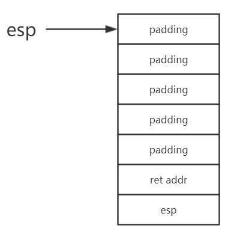
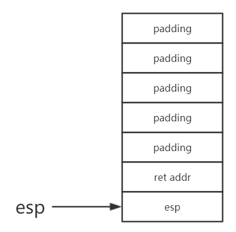
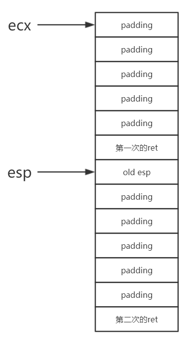

参考耗子哥哥的 http://showlinkroom.me/2017/01/22/pwnable-tw/

发现我对汇编的掌握还远远不够，不能一眼判断出它的功能和中断相关代码的作用。。

start 是一道简单的纯汇编程序。我们可以看到，在代码中有几处 Linux 系统调用的位置。有关 Linux 系统调用可以参考这个网页：https://www.cs.utexas.edu/~bismith/test/syscalls/syscalls.html。

这里涉及到的系统调用主要有 `al=4` 和 `al=3`。分别对应 `sys_write` 和 `sys_read`。根据上述网页的表格，我们可以看到在 `write` 时其他的参数如下：

输入：

| reg  | desp             |
| ---- | ---------------- |
| eax  | 4                |
| ebx  | 文件描述符       |
| ecx  | 写入数据的地址   |
| edx  | 最大写入的字节数 |

输出：

| reg  | desp                         |
| ---- | ---------------------------- |
| eax  | 实际发送的字节数或其他功能号 |

read：

输入：

| reg  | desp             |
| ---- | ---------------- |
| eax  | 3                |
| ebx  | 文件描述符       |
| ecx  | 读取数据的地址   |
| edx  | 最大读取的字节数 |

输出：

| reg  | desp                         |
| ---- | ---------------------------- |
| eax  | 实际读取的字符数或其他功能号 |

嘛，既然是第一题，我们详细分析一下吧。

略过前面的初始化过程，这是第一段：

```assembly
.text:0804806E                 push    ':FTC'
.text:08048073                 push    ' eht'
.text:08048078                 push    ' tra'
.text:0804807D                 push    'ts s'
.text:08048082                 push    2774654Ch
.text:08048087                 mov     ecx, esp        ; addr
.text:08048089                 mov     dl, 14h         ; len
.text:0804808B                 mov     bl, 1           ; fd
.text:0804808D                 mov     al, 4
.text:0804808F                 int     80h             ; LINUX - sys_write
```

这一段输出 `Let's start the CTF:`。

下一段是这样的：

```assembly
.text:08048091                 xor     ebx, ebx
.text:08048093                 mov     dl, 60
.text:08048095                 mov     al, 3           ; sys_read
.text:08048097                 int     80h             ; LINUX -
.text:08048099                 add     esp, 20
.text:0804809C                 retn
```

其实这里面有两个部分，第一部分是通过系统调用读取字符，允许最大长度是 60。第二段是调整栈顶指针，向下移动 20。这个时候我们就会发现，输入的最大长度是 60 然而保留的空间是 20，发生了栈溢出。那么在程序执行的过程中，esp 都会指向哪里呢？

在第一部分结束之后，esp 会指向字符串的顶端：

```
00:0000│ ecx esp  0xffffce94 ◂— 0x34333231 ('1234')
01:0004│          0xffffce98 ◂— 0x38373635 ('5678')
02:0008│          0xffffce9c ◂— 0x32313039 ('9012')
03:000c│          0xffffcea0 ◂— 0x36353433 ('3456')
04:0010│          0xffffcea4 ◂— 0xa393837 ('789\n')
05:0014│          0xffffcea8 —▸ 0x804809d (_exit) ◂— pop    esp
06:0018│          0xffffceac —▸ 0xffffceb0 ◂— 0x1
07:001c│          0xffffceb0 ◂— 0x1
```

由于本题是汇编写成的，栈的分配肯定也不能简单的套用栈帧的模型。查看它的初始化，最开始的时候是把 esp 压入栈内的。因此此时栈的结构应该是这样子的：



在执行本次 retn 之后的栈帧结构是什么样子的呢？



实际上，数据的区域都属于我们可以控制的栈的区域。当然我们也可以修改 ret addr，跳到我们想要的位置上（例如 shellcode 所在的位置）。事实上，如果我们将可控制的栈地址存入 shellcode，然后在返回的时候跳到这个地址不就可以取得权限了吗？但是由于种种原因，我们可能无法直接取得 esp 的地址，接下来该怎么做呢？（其实已经很明显了）

既然在这个程序中有输出的汇编，我们完全可以利用它。如果此时我们跳到

```assembly
.text:08048087                 mov     ecx, esp        ; addr
; 上面那一部分到底要不要跳呢？
.text:08048089                 mov     dl, 14h         ; len
.text:0804808B                 mov     bl, 1           ; fd
.text:0804808D                 mov     al, 4
.text:0804808F                 int     80h             ; LINUX - sys_write
.text:08048091                 xor     ebx, ebx
.text:08048093                 mov     dl, 60
.text:08048095                 mov     al, 3           ; sys_read
.text:08048097                 int     80h             ; LINUX -
.text:08048099                 add     esp, 20
.text:0804809C                 retn
```

这一段，不就可以将保存下来的 esp 输出了嘛~

接下来我们就可以去寻找符合条件的 shellcode 了。可惜我们会发现大部分 shellcode 的长度都是大于 20 个字节的，这又该怎么办呢？

在本次输出 esp 地址之后我们也能分析出当前的栈布局：



如果我们没有修改 ecx、dl 的值，而是从修改 bl 开始的话，会发生什么情况呢？此时 dl 的大小是 60，ecx 的位置如图所示。显而易见，它会输出 60 字节！这远远超过了我们的要求，泄露 esp 的地址当然不在话下啦。另外，在输出之后我们还要输入，它支持的长度至少有 48 字节，与之前相比宽松很多了。这样我们就可以尝试构造 payload 了。

怎样构造 payload 呢？首先我们要填充大小为 20 的空间，接下来填充 0x0804808B（也就是返回的时候跳转到这里，让它把 esp 输出。当然，我们要从输出中取出我们需要的 esp。）接下来也有相关的输入，这时候我们再填充 shellcode 然后计算长度，填充 shellcode 的地址就好啦。

拿到 shell 后死活找不到 flag。最后发现 `/home` 下面的是文件夹不是文件。。

`FLAG{Pwn4bl3_tW_1s_y0ur_st4rt}`